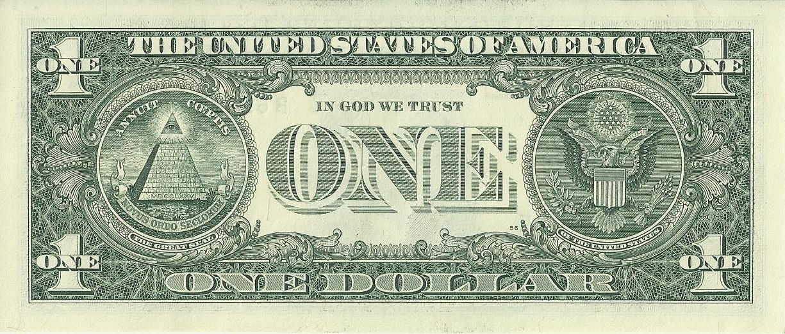
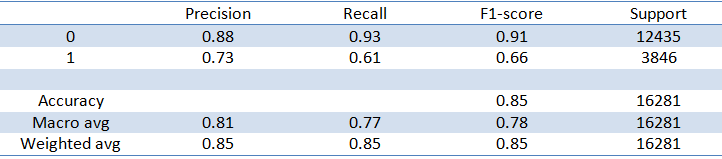
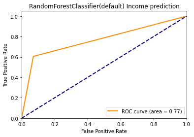
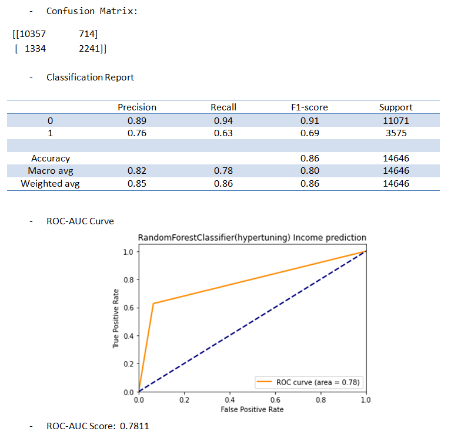

# Model evaluation challenge - US Income

## The Data

The datasets `data_train.csv` and `data_test.csv` 

## The Mission

*Are you able to predict the income of every US citizen?*

### Constraints

- You must use `RandomForestClassifier()` from `sklearn`.
- Create **functions**, do **not** create a single huge script
- Each **function or class** has to be typed
- Each **function or class** has to contain a docstring in a [consistent format](https://stackoverflow.com/a/24385103).
- Your code should be **commented**.
- Your code should be **cleaned of any commented unused code**.

### The Deliverables

- Baseline accuracy
- Multiple evaluation metrics
- Hyper parameter tuning
- Some type of validation strategy

## US Income Prediction & Model Evaluation

### Installation
#### Python version
* Python 3.9
#### Packages
* Numpy
* Pandas
* Sklearn

### Usage

| File                | Description                             |
|---------------------|-----------------------------------------|
| model_evaluation.py | Python file containing *functions* for: -Model Fitting -Model Tuning -Evaluation |
| assets              | Folder containing: -datasets -visuals |

### RandomForestClassifier()

#### Step 1. Baseline Accuracy

* Score 
Evaluating the model on the training set yields an accuracy of 99.99% 
Evaluating the model on the testing set yields an accuracy of 85.30%

* Confusion Matrix 
[[11559   876] 
 [ 1518  2328]]

* Classification Report 
 
 
 * ROC-AUC Curve 
 
 
 * ROC-AUC Score: 0.7674
 
#### Step 2. Model Tuning

#### Splitting Train-test: Random State

* random_state = [1,2,3,4]
* Results: 
Evaluating the model on the testing set yields an accuracy of 85.76% with random state 0 
Evaluating the model on the testing set yields an accuracy of 85.71% with random state 1 
Evaluating the model on the testing set yields an accuracy of 85.99% with random state 2 
Evaluating the model on the testing set yields an accuracy of 85.73% with random state 3 

##### Cross-Validation

* cv = 5 (k=folds)
* scores: 
    [0.8557968  0.85426055 0.86050799 0.85446538 0.85178736] 
    Accuracy: 85.54% (+/- 0.29) 
* cv = 7 (k=folds)
* scores: 
    [0.85275986 0.85488959 0.86062518 0.86277603 0.85531976 0.85632349
    0.8561801 ] 
    Accuracy: 85.70% (+/- 0.32)
* cv = 9 (k=folds)
* scores: 
    [0.85105991 0.8556682  0.85917051 0.85840708 0.86264749 0.85969764
    0.85029499 0.85435103 0.85490413] 
    Accuracy: 85.62% (+/- 0.39)

##### GridSearchCV

* Param_grid = {'n_estimators': [100,200,400,800], 'criterion': ['gini', 'entropy'], 'max_features: ['auto', 'sqrt', 'log2']}
* Best Parameters: {criterion: 'gini','max_features': 'auto', 'n_estimators': 800}

### Step 3: Results
Evaluating the model on the training set yields an accuracy of 99.99% 
Evaluating the model on the testing set yields an accuracy of **86.09%** 

 
 

