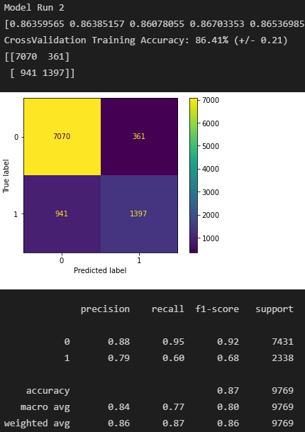
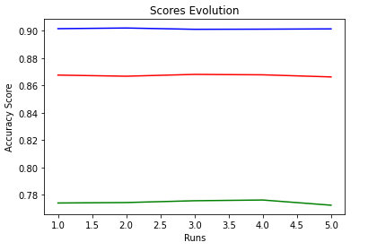

# Model evaluation challenge - US Income

## The Data

The datasets `data_train.csv` and `data_test.csv` 

## The Mission

*Are you able to predict the income of every US citizen?*

### Constraints

- You must use `RandomForestClassifier()` from `sklearn`.
- Create **functions**, do **not** create a single huge script
- Each **function or class** has to be typed
- Each **function or class** has to contain a docstring in a [consistent format](https://stackoverflow.com/a/24385103).
- Your code should be **commented**.
- Your code should be **cleaned of any commented unused code**.

### The Deliverables

- Baseline accuracy
- Multiple evaluation metrics
- Hyper parameter tuning
- Some type of validation strategy

## US Income Prediction & Model Evaluation

### Installation
#### Python version
* Python 3.9
#### Packages
* Numpy
* Pandas
* Sklearn

### Usage

| File                | Description                             |
|---------------------|-----------------------------------------|
| model_evaluation.py | Python file containing *functions* for: -Model Fitting -Model Tuning -Evaluation |
| assets              | Folder containing: -datasets -visuals |

### RandomForestClassifier()

#### Step 1. Baseline Accuracy

* Score 
Evaluating the model on the training set yields an accuracy of 99.99% 
Evaluating the model on the testing set yields an accuracy of 85.30%

**Note: The model shows overfitting**

* Confusion Matrix 
[[11559   876] 
 [ 1518  2328]]

* Classification Report 
 
 
 * ROC-AUC Curve 
 
 
 * ROC-AUC Score: 0.7674
 
#### Step 2. Model Tuning

#### Random State (train-test split)

* random_state = [1,2,3,4]
* Results: 
Evaluating the model on the testing set yields an accuracy of 85.76% with random state 0 
Evaluating the model on the testing set yields an accuracy of 85.71% with random state 1 
Evaluating the model on the testing set yields an accuracy of **85.99%** with **random state 2** 
Evaluating the model on the testing set yields an accuracy of 85.73% with random state 3 

##### GridSearchCV

* Param_grid ={ 'n_estimators': [5,10,50,100,250],  'criterion': ['gini', 'entropy'],  'max_features': ['auto', 'sqrt', 'log2'],  'max_depth': [2,4,8,16,32,None] }
* **Best Parameters: {criterion: 'gini','max_features': 'auto', 'n_estimators': 250, 'max_depth: 16}**

### Step 3: Evaluating Results
#### Model Run 5 times (Including CrossValidation)

**1st Run**

    

    

**2nd Run**

    

    

**3rd Run**

    

    

**4th Run** 

    

    

**5th Run** 

    

    

### Evolution of Scores 
**Legend:** 
**Blue = Training Set** 
**Red = Test Set** 
**Green = ROC-AUC Score** 

    

### Conclusions

* The Initial model shows: 
**Training set score: 99.99% (overfitting)** 
**Test set score: 85.30%** 
* The final model after tuning shows: 
**Max Training set score: 90.19%** 
**Max Test set score: 86.81%** 

* Evaluation Techniques used: 
**train_test_split** - random_state [1-4] 
**GridSearchCV** - best_params_ 

**CrossValidation** - kfold = [4-8] 
**Metrics** - Confusion Matrix / Classification Report / accuracy_score / ROC-AUC score

